= Learn Istio in under 3 hours

Three years ago, I wrote an article titled 
  https://medium.com/google-cloud/back-to-microservices-with-istio-p1-827c872daa53["Back to Microservices with Istio"]
for _Google Cloud - Community_. I published it there to reach a reader base interested in the latest technologies built on top of Kubernetes. At that point, Istio was a niche technology.

.Fast-forward three years: 
* I co-authored the book 
  "https://www.manning.com/books/istio-in-action?utm_source=rinor&utm_medium=affiliate&utm_campaign=book_posta2_istio_9_30_18&a_aid=rinor&a_bid=9f6a70f3[Istio in Action]" 
together with Christian Posta 
  (https://twitter.com/christianposta[@christianposta]), which is recently published by Manning.
* I joined 
  https://www.solo.io/[Solo.io], 
where I collaborate daily with clients to best utilize the service mesh capabilities. Be it for improving resiliency, reducing the risk of shipping new software, improving the security posture, or any of the myriad capabilities it enables.

Kubernetes, which even then was reaching wide adoption, has now become a https://www.cncf.io/reports/cncf-annual-survey-2021/#:~:text=Kubernetes%20has%20crossed%20the%20adoption%20chasm%20to%20become%20a%20mainstream%20global%20technology%C2%A0[mainstream global technology], and as the number of services operated on it increases -- so will the number of organizations adopting Istio increase too.

Furtherly, *Istio is not a niche technology anymore!* After many improvements in the user experience -- for example, installation and day-2 operations became way easier -- Istio has been adopted by organizations of different sizes and industries. At the same time, it is continuously expanding its toolset further by adding support for virtual machines, making the mesh scale into multiple clusters, and much more.

The last thing you need to know is that the market lacks people with this kind of knowledge. We need _you!_ 
That’s why I entirely rewrote this article to be a thorough introduction to Istio and show what it does under the hood because I don't want you only to know "what" it does but as well "how" it does it.

== Introducing Istio

**Istio** is an open-source project that started in partnership between teams from Google, IBM, and Lyft. Later on, the number of contributors has grown to include many other organizations such as Solo.io, Tetrate, Aspen Mesh, and so on. 

It solves many microservice concerns, to name a few:

* **Traffic management:** Resolving network unreliability with: timeouts, retries, load balancing
* **Security:** Encrypting traffic in transit; authentication and authorization of end-users and services
* **Observability:** Making the system observable with traces, metrics, and logs

These complexities or concerns can be solved in the application layer, but your services become bloated with libraries that handle traffic management, service discovery, authentication, instrumentation, and everything else that's not core to your business.

Let’s illustrate this with a conversation between a product manager and a developer:
****
PM: How long will it take to add a feedback feature to the application?

Dev: Two sprints.

PM: What…?! That’s just a CRUD!

Dev: Creating the CRUD is easy, but we need to authenticate and authorize users and services. And because the network is not reliable, we need to implement retries and circuit breakers. We need timeouts and bulkheads to ensure that we don't take the whole system down. Additionally, to detect issues, we need monitoring and tracing […]
****

You get the idea. All the ceremony and effort that must go in for us to add one simple service is enormous. The figure below visualizes all the layers implemented in your application code that sip your team's resources. Resources that would be better spent if focused on core business functionality.

.All the application code layers
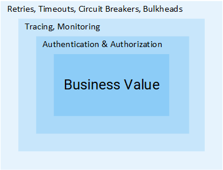[The layers of a microservice in addition to the core business functionality]

Istio removes all the above-mentioned cross-cutting concerns from our services and implements those at the platform layer. Let's see how that's achieved.

NOTE: This article assumes that you have a working knowledge of Kubernetes. If it’s not the case, I recommend you read
https://www.freecodecamp.org/news/learn-kubernetes-in-under-3-hours-a-detailed-guide-to-orchestrating-containers-114ff420e882/[my introduction to Kubernetes] 
and then proceed with this article.

== The Idea of Istio

In a world without Istio, one service makes direct requests to another and in case of failures, the service is responsible for handling those. It can do so by retrying, dropping requests that take too long, opening the circuit breaker to protect services from overload, and so on.

.Service-to-service traffic
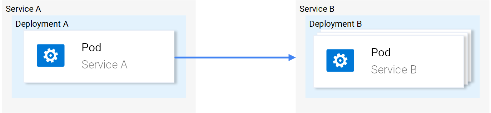

That's why we have soo many libraries for service discovery, resiliency, instrumentation, and so on. Considering that every service has to address these concerns, solving those on the platform layer instead of in the application code makes sense.

Istio devised an ingenious solution. It intercepts all network communication and redirects it to a capable sidecar proxy that runs alongside every service. *And it is the proxies' responsibility to resolve all the concerns mentioned above.*

The animation below shows how the sidecar proxies intermediate traffic and implement retries, and failovers for failed requests.

.Service to service traffic in Istio
image::./images/services-in-istio.gif[][Service to service traffic in Istio]

The sidecar proxy does more than that. We will elaborate on many of its features in this article. But what is key to note is that the application itself is entirely oblivious of the service proxy or even the entire mesh. If asked about the service mesh, your application would say, "What the hell is a service mesh?!"

.Drawing by Victoria Dimitrakopoulos


=== The sidecar proxy

For the sidecar proxy to discern if the request failed or not, it has to understand application layer protocols, such as HTTP. Proxies that act at this layer are _application layer proxies_ or _layer 7 proxies_. I'll use those terms interchangeably in the continuation of the article.

.By intercepting all service-to-service traffic, application layer proxies can implement the following:
* **Fault tolerance** — Using response status codes, the proxy understands when a request fails and retries it.
* **Fine-grained traffic management** — Route requests with specific headers to intended services. Such as sending only beta users to a new beta release of an application
* **Metrics** — The count of successful responses; failed ones; The time it took for a service to respond, and so on.
* **Tracing** — Adds special headers in every request and traces them throughout the services in the cluster.
* **Security** — Authenticate services and end-users using certificates and JWT tokens, respectively

These are just a few of the capabilities enabled when managing traffic at the application networking layer and get you intrigued about Istio!

== Istio's architecture: the different planes

Istio is composed of _the data plane_ and _the control plane_.

=== The data plane

The data plane comprises all pods that have the sidecar proxy injected. In the Istio community, we frequently refer to them as mesh workloads or simply _workloads_. Meanwhile, we refer to workloads without sidecar as _legacy workloads_ because they are evil and dangerous, as you will see later on in the security section. 

[NOTE] 
_"Why don't we simply call 'em pods?"_ -- Because mesh workloads are not bound to a cluster and may be running in different ones, or on virtual machines, and actually anywhere you can run and configure the sidecar proxy.

==== Zooming into one workload

.Each workload has the following four components:
* **The init container** - you don't have to worry about this -- suffices to know that it configures traffic redirection to the sidecar proxy.
* **The pilot-agent** - you don't have to worry about this -- suffices to know that it does initial bootstrapping of the sidecar proxy.
* **The sidecar proxy** - you neither should worry about this -- suffices to know that it is the concrete component that implements traffic management, security, and observability features.
* *The app itself*

Istio uses Envoy as the sidecar proxy. Envoy is a versatile layer 7 proxy that is highly extensible and has a vibrant community behind it.

Envoy differentiates itself from other proxies by being dynamically configurable through an API that it exposes -- You may ask, "**Why is it important?**" Because Envoy has to be kept up to date with the changes that occur in the environment. For example, in Kubernetes, workloads are short-lived; new services are consistently deployed, workloads are rescheduled, and users might define new routing rules or policies. Therefore, we need _"something"_ that continuously updates the proxy configuration.

That "something" is the _control plane_, which uses the Envoy API to synchronize the proxy with the changes occurring in the underlying platform.

=== The control plane

Istio's control plane is a Kubernetes controller that watches the Kubernetes API server to learn about the workloads running in the platform and generates Envoy configuration on how to route the traffic to and from these workloads.

Additionally, Istio exposes an API in the format of Kubernetes Custom Resource Definitions (CRDs) with which service-operators (_you_) can configure the data plane. +
With _configuring the data plane_, we imply that you configure the workloads with policies, routing rules, retries, and so on.

.The control plane configures the data plane
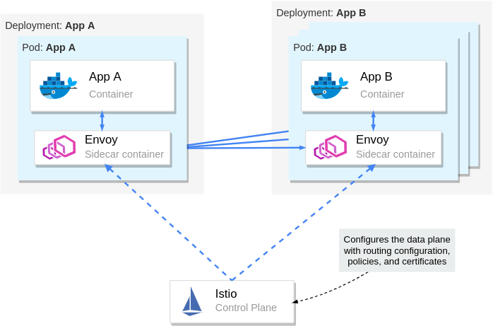

We learned quite a lot about Istio's architecture. From here onwards, we'll crank down theory to the bare minimum and crank up practical examples that will help you understand and memorize the content.

== Istio in Practice

=== Prerequisites: Setting up a Kubernetes cluster

Before learning about Istio and how to use it, you need to get your hands on a Kubernetes cluster with admin access. Understandably, you will need `kubectl` to interact with the cluster. To install `kubectl`, head over to https://kubernetes.io/docs/tasks/tools/install-kubectl/[the official documentation and follow the instructions for your operating system].

This article uses _Kubernetes In Docker_, also known as `kind`. You may use any other local Kubernetes distribution such as 
Docker-Desktop (https://docs.docker.com/desktop/[how to install] and https://docs.docker.com/desktop/kubernetes/[use it]), 
https://rancherdesktop.io/[Rancher Desktop], or
https://minikube.sigs.k8s.io/docs/start/[Minikube]. Just make sure to be on at least version 1.23 of Kubernetes. 

To install `kind`, follow the installation instructions over at https://kind.sigs.k8s.io/docs/user/quick-start/.

=== Creating a cluster with `kind`

After installing `kind`, create a Kubernetes cluster with the command below:

[source,bash,attributes]
----
kind create cluster --image=kindest/node:v1.23.1
----

This command pulls a container image with the Kubernetes version 1.23.1 and runs it on your container runtime. For example, if your runtime is `docker`, you can see the running container by executing:

```bash
docker ps
```

Your output will show a new container running:
```
CONTAINER ID   IMAGE                  COMMAND        NAMES
2974301ffa31   kindest/node:v1.23.1   "/usr/loca…"   kind-control-plane
```

NOTE: Istio 1.13 is compatible with versions 1.20 and onwards of Kubernetes. To learn about the supported releases of Kubernetes, check the official docs at https://istio.io/latest/docs/releases/supported-releases/[Istio: Supported Kubernetes releases.]

=== Installing Istio on the cluster

You can install Istio either with the `istioctl` utility or the `helm` package manager. To get `istioctl`, download the Istio release artifacts, as shown below.

[source,bash,attributes]
----
curl -L https://istio.io/downloadIstio | \
  ISTIO_VERSION=1.13.2 TARGET_ARCH=x86_64 sh -
----

In the downloaded directory, you will find the `istioctl` CLI tool under `istio-1.13.2/bin/istioctl`. Next, move the binary within your PATH environment variable--so that you can execute `istioctl` commands from any directory.

After that, install Istio with the command below.

[source,bash,attributes]
----
istioctl install --set profile=demo -y
----

It might take several minutes for this command to complete as it waits for all Pods to be running. After it finishes, print the deployed Pods in the Istio installation namespace.

[source,bash,attributes]
----
kubectl get pods -n istio-system
----

You should see the output below.

----
NAME                                   READY   STATUS    RESTARTS
istio-egressgateway-6cf5fb4756-r569f   1/1     Running   0
istio-ingressgateway-dc9c8f588-cn2z4   1/1     Running   0
istiod-7586c7dfd8-2nbsk                1/1     Running   0
----

.The installed components are:
* **Istio egress gateway** - used for securing egress traffic
* **Istio ingress gateway** - the entry point of traffic coming into your cluster
* **Istiod** - Istio's control plane that configures the service proxies

=== Installing the Istio add-ons

The Istio artifacts downloaded earlier contain sample tools to visualize the generated telemetry. To deploy those into your cluster, execute the command below.

[source,bash,attributes]
----
kubectl apply -f istio-1.13.2/samples/addons/
----

This installs the following tools: Prometheus, Grafana, Kiali, and Jaeger. We will take a look at those later on. But, first, we need some services.

=== The sample application: Sentiment Analysis

We'll run the microservice application used in my https://www.freecodecamp.org/news/learn-kubernetes-in-under-3-hours-a-detailed-guide-to-orchestrating-containers-114ff420e882[Kubernetes introductory article]; it's complex enough to showcase Istio's features in practice.

.The sentiment analysis services
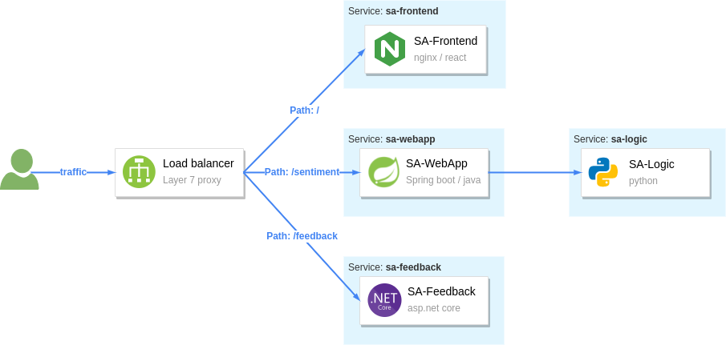

.The figure above shows the services that comprise the app:
* The *SA-Frontend* -- service serves the frontend; a react javascript application
* The *SA-WebApp* -- service handles queries for analyzing the sentiment of sentences
* The *SA-Logic* -- service performs sentiment analysis
* The *SA-Feedback* -- service records the user feedback about the accuracy of the analysis 

Additionally, the figure shows a layer 7 proxy that reverse-proxies traffic based on the request's path. Within Istio's mesh, the _Ingress Gateway_ is the entry point for traffic and routes it to the services.

== Running the services on the mesh

To make services part of the mesh, you have to inject the sidecar proxy into their application pods. This can be done manually or automatically.

For automatic sidecar injection, you label the namespaces with `istio-injection: enabled`. After that, any pods deployed into those namespaces will have the sidecar injected (utilizing a Kubernetes feature called mutating webhooks that modifies the pod definition).

Create a namespace and label it for automatic injection.

[source,bash,attributes]
----
kubectl create ns demo
kubectl label ns demo istio-injection=enabled
----

Switch the kubectl context to the `demo` namespace to apply subsequent commands to it.

[source,bash,attributes]
----
kubectl config set-context --current --namespace=demo
----

Next, clone the repository containing the services and configuration we need throughout the article.

[source,bash,attributes]
----
git clone https://github.com/rinormaloku/master-istio.git
cd master-istio
----

Proceed to deploy the services:

[source,bash,attributes]
----
kubectl apply -f ./kube
----

Next, verify that the sidecar got injected into each of the service pods with the following command:

[source,bash,attributes]
----
$ kubectl get pods -n demo

NAME                           READY     STATUS    RESTARTS   AGE
sa-feedback-55f5dc4d9c-c9wfv   2/2       Running   0          12m
sa-frontend-558f8986-hhkj9     2/2       Running   0          12m
sa-logic-568498cb4d-2sjwj      2/2       Running   0          12m
sa-logic-568498cb4d-p4f8c      2/2       Running   0          12m
sa-web-app-599cf47c7c-s7cvd    2/2       Running   0          12m
----

Ensure that under the `READY` column, you see the value “2/2”. This shows that both containers are running: the app container, and the sidecar proxy. Visualized in the figure below, where we zoom into one Pod.

.Zooming into one Pod: The sidecar container is injected into the pod
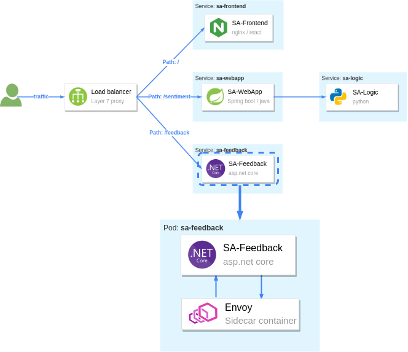

Our services are ready to receive end-user traffic. So for that purpose, we got to expose those next.

== Ingress Gateway: admitting traffic into the mesh

Istio's ingress gateway is a special proxy at the edge of the mesh that admits traffic from the public network and routes it to the services within the cluster. 

Earlier, when we printed the pods in the istio installation namespace, we saw it in the `Running` state. This gateway is exposed by a Kubernetes Service of type `LoadBalancer`. Which we can query as follows:

[source,bash,attributes]
----
kubectl get svc -n istio-system -l istio=ingressgateway
NAME                   TYPE           CLUSTER-IP     EXTERNAL-IP
istio-ingressgateway   LoadBalancer   10.96.176.88   <pending>  
----

If you are using `kind` the external IP address will be in `Pending` state. However, in managed Kubernetes clusters, the cloud provider would provision a load balancer with a static IP address that you can use to route traffic to the gateway.

As a workaround, we can port-forward it to our local environment. Open a second terminal, execute the following command, and leave it running for the entire article.

[source,bash,attributes]
----
kubectl port-forward -n istio-system svc/istio-ingressgateway 8080:80
----

Now, traffic to `localhost:8080` will be forwarded to the ingress gateway. If you open the browser, type that address, and hit enter, you'll find out that the gateway rejects your request. That's the default behavior of the gateway.

=== Gateway API: admit traffic

Istio defines the `Gateway` custom resource with which you can configure the type of traffic to admit into the mesh. For example, to accept HTTP traffic on the port 80, we'll use the configuration below:

[source,bash,attributes]
----
apiVersion: networking.istio.io/v1alpha3
kind: Gateway
metadata:
  name: http-gateway
spec:
  selector:
    istio: ingressgateway
  servers:
  - port:
      number: 80
      name: http
      protocol: HTTP
    hosts:
    - "*"
----

Most of the above configuration is self-explanatory, but what might stand out is the selector `istio: ingressgateway`. 

The question is: _"Why do we need it?"_ 

A service mesh can have multiple ingress gateways. Usually, you'd use this in multi-tenant environments. In our instance, we'll apply the `Gateway` configuration to the default ingress gateway, which is labeled with `istio=ingressgateway`.

Apply the `Gateway` to the cluster:

[source,bash,attributes]
----
kubectl apply -f istio/http-gateway.yaml 
----

After applying the `Gateway` configuration, traffic on port 80 will be admitted for all hosts (as indicated by the wildcard host "*"). 

Next, we need to configure what to do with the admitted traffic.

=== VirtualService API: Route traffic

The `VirtualService` resource configures traffic routing within the mesh for all proxies and gateways. In our instance, we want to route traffic from the ingress gateway to a set of workloads, as shown below.

.Istio's ingress gateway routes traffic based on the HTTP location header
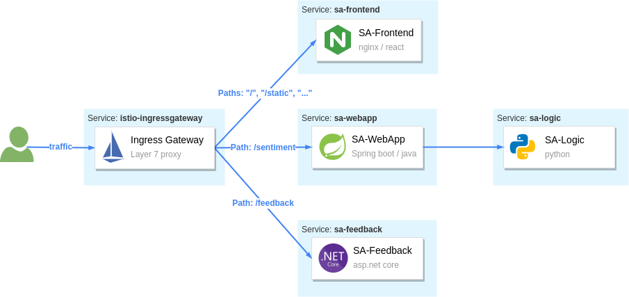

Let’s break down the requests that should be routed to SA-Frontend:

* **Paths matching exactly** `/`should be routed to SA-Frontend to get the Index.html
* **Paths prefixed with** `/static/*` should be routed to SA-Frontend to get any static files needed by the frontend, like Cascading Style Sheets and JavaScript files.
* **Paths that match the regex** `'^.*\.(ico|png|jpg)$'` should be routed to SA-Frontend.

That's achieved with the following configuration:

[source,bash,attributes]
----
apiVersion: networking.istio.io/v1alpha3
kind: VirtualService
metadata:
  name: sa-external-services
spec:
  hosts:
  - "*"
  gateways:
  - http-gateway                      # 1
  http:
  - match:
    - uri:
        exact: /
    - uri:
        prefix: /static
    - uri:
        regex: '^.*\.(ico|png|jpg)$'
    route:
    - destination:
        host: sa-frontend             # 2
        port:
          number: 80
----

. This `VirtualService` applies to requests coming through the `http-gateway` that we defined in the earlier section
. Destination defines the service where to route traffic

[NOTE]
The configuration above is in the file `vs-route-ingress.yaml`. It also contains the routing rules for traffic to SA-WebApp and SA-Feedback. It's omitted for brevity in the above listing.

Apply the `VirtualService` to the cluster.

[source,bash,attributes]
----
kubectl apply -f istio/vs-route-ingress.yaml
----

The control plane propagates the configuration to the gateway within a few seconds. After that, you can access the app on the address http://localhost:8080/, provided you are still port-forwarding Istio's ingress gateway to your local environment.

Open the browser on that address. You'll see the application, as shown in the image below.


The figure below shows how those two resources configure the ingress gateway. The `Gateway` resource configures it for admitting traffic and the `VirtualService` configures where the to route the admitted traffic.

.Configuring Istio's ingress gateway to admit and route traffic 
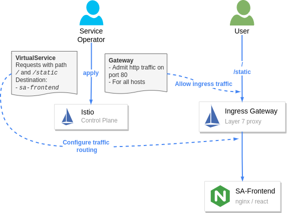

Hooray! We got the services up and running; we injected the sidecar into them and routed end-user traffic to those.

You might wonder: _"Why is this big fuss about running workloads into the mesh? After all, routing traffic to workloads using path-based routing can be done with any layer 7 ingress controller."_

We answer that next, when we show the security and observability benefits you've gained. So let's get started!

== Observability

Istio's sidecar proxy -- namely the envoy proxy -- generates access logs, metrics, and traces, for all inbound and outbound traffic.
The metrics provide insights into the system's workings and help answer questions such as: Is the system healthy? What's the success rate of a service? And so on.

Generating the metrics is half of the story. The other half is collecting and visualizing the information in a way that prompts action. 
We're going to use the Istio add-ons that we installed earlier:

* Prometheus for collecting metrics 
* Grafana for visualizing those
* Jaeger for snitching traces
* Kiali brings all telemetry data together

But what if you already got some observability tools in your organization? -- Even better, you can integrate Istio with those :))

=== Grafana: Visualizing metrics

Grafana visualizes the metrics collected by Prometheus. Open the Grafana dashboard, and let's see what we get out of the box.

[source,bash,attributes]
----
istioctl dashboard grafana
----

The above command will port-forward Grafana to your local environment and open it in your default browser. Next, navigate to "Istio" > "Istio Service Dashboard" and filter the output by using the "Service" dropdown and select "sa-webapp" service. 

If the graphs on your side look a little empty, then generate traffic by executing the command below:

[source,bash,attributes]
----
while true; do \
  curl -i http://localhost:8080/sentiment \
  -H "Content-type: application/json" \
  -d '{"sentence": "I love yogobella"}'; \
  sleep .$RANDOM; done
----

Leave this command running for the remainder of the article, as we will need the traffic in multiple instances.

Below we visualize the metrics of the `sa-webapp` service.

.Grafana: Visualizing metrics for the sa-webapp service
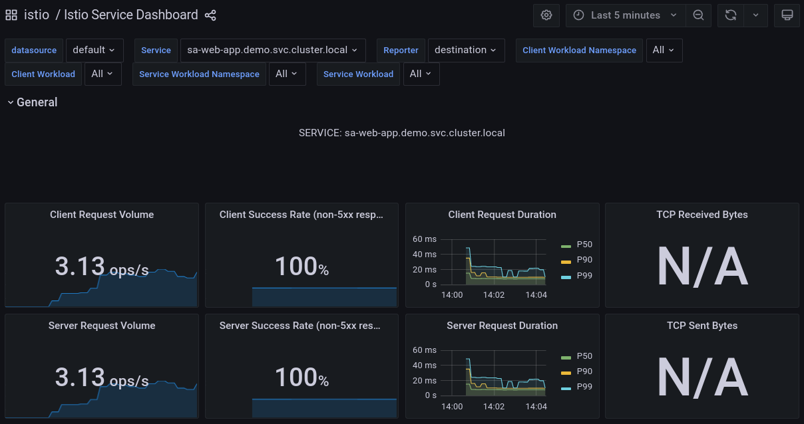

Prometheus and Grafana enable us to understand our services' health, performance, and improvements or degradations throughout time. It's up to you to further investigate the graphs and the information they visualize.

Next, we will investigate tracing requests while those pass throughout services.

=== Jaeger: Snitching the traces of a request

It's sensible to ask, "Why do we trace requests _nowadays_? We weren't doing that for monoliths?" -- switching to microservices solves some difficulties, though inadvertently, it brings some of the inherent properties of distributed systems that require other solutions. For example, the property of being distributed makes localizing failures relatively tricky. +
Imagine that an end-user receives a failed request -- "what was the cause?" To locate the failure, you'd have to check all the services that participated in serving the request.

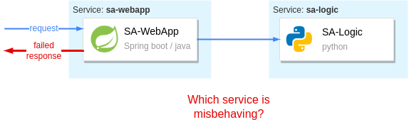

Without proper tools, the only available option is to take off your _Engineers_ hat and put on your _Detectives_ hat. Then you'd piece together the story of the "_failed request_" by querying all service logs, filtering by timestamp, and trying to make sense of all the data. Then, you will slowly but surely get to the bottom of it and find the culprit!

Playing detective might be a fun activity the first time -- but it will quickly get mundane because failures are a common occurrence; we need efficient tools to locate those in distributed systems.

*Jaeger is such a tool.*

[NOTE]
Jaeger comes from the German word for "hunter" (written Jäger). It implies "hunting down failures."
Though, I prefer my detective analogy way more. Thus strikethrough [.line-through]#Jaeger#  and checkmark *Inspector Gadget* 

To trace requests without Istio, you'd have to instrument all your services to generate traces and push those to *Inspector Gadget*. _(yeah... I'm rolling with it 🤣)_

On the contrary, with Istio, the sidecar proxies generate trace headers (as HTTP headers) and push those to *Inspector Gadget* (_that's the last time, I promise_). This is done by every service that has the sidecar proxy.

You only have to *update your services to propagate the generated trace headers to upstream services*. Otherwise, each proxy generates the headers anew. And when the traces are stitched together, it wouldn't give us the complete picture of the request.

The diagram below visualizes the process.

.How tracing information is generated and pushed to the Trace Servers
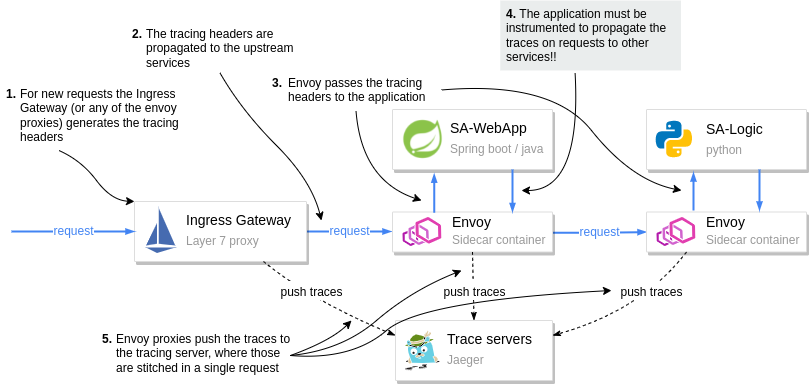

Pay attention to step 4 in the diagram. It is the application's responsibility to pass on the tracing headers to the upstream. Passing tracing headers is critical, as the next proxy will pick up the existing headers and understand that this is a continuation of a request already being traced. Thus it will reuse the tracing headers  (such as the `x-request-id`), and then it'll add additional data that it records. The trace headers are used to combine all the information for a request in Jeager.

Open the Jaeger dashboard and see how traces show the full span of a request.

[source,bash,attributes]
----
istioctl dashboard jaeger
----

The above command will port-forward Jeager to your local environment and open it in your default browser. 

Look around in the Jaeger user interface and investigate individual requests. For example, the image below shows the traces for a request to analyze the sentiment of a sentence.

.The full request flow through the mesh
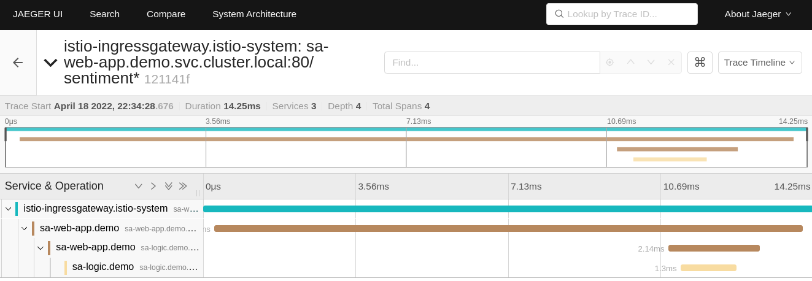

The image shows how the request started at the ingress gateway (that's the first contact with a service mesh workload). Then the request was routed to `sa-webapp`, and `sa-logic`, respectively.

[NOTE]
To learn about the headers your application needs to propagate and client libraries for that, check out https://istio.io/latest/about/faq/distributed-tracing[Istio's Distributed Tracing FAQ] and read the answer to https://istio.io/latest/about/faq/distributed-tracing/#how-to-support-tracing["What is required for distributed tracing with Istio?"]

Traces clarify where the request failed and which service returned the error, and so on. But we learn more about the failure using the proxy access logs and the application logs.

=== Access logs

Envoy records every individual request as access logs. Let's print out one log entry from the `sa-webapp` service to see the recorded data.

[source,bash,attributes]
----
kubectl logs deploy/sa-webapp -c istio-proxy | tail -n 1 

[2022-04-18T12:09:44.091Z] "POST /sentiment HTTP/1.1" 200 - via_upstream - "-" 32 46 5 5 "10.244.0.6" "curl/7.74.0" "bfb9e6e5-2968-9b25-b256-f0917aa6b0bb" "localhost:8080" "10.244.0.16:8080" inbound|8080|| 127.0.0.6:51819 10.244.0.16:8080 10.244.0.6:0 outbound_.80_._.sa-webapp.demo.svc.cluster.local default
----

It looks a lot like gibberish, doesn't it? This is the TEXT format, where each piece of information is space-separated. You can learn what each space-separated field stands for by printing the access log format — achieved with the command below.

[source,bash,attributes]
----
istioctl pc all deploy/sa-webapp -o json | grep log_format -A 2 | tail -n 2

"text_format_source": {
  "inline_string": "[%START_TIME%] \"%REQ(:METHOD)% %REQ(X-ENVOY-ORIGINAL-PATH?:PATH)% %PROTOCOL%\" %RESPONSE_CODE% %RESPONSE_FLAGS% %RESPONSE_CODE_DETAILS% %CONNECTION_TERMINATION_DETAILS% \"%UPSTREAM_TRANSPORT_FAILURE_REASON%\" %BYTES_RECEIVED% %BYTES_SENT% %DURATION% %RESP(X-ENVOY-UPSTREAM-SERVICE-TIME)% \"%REQ(X-FORWARDED-FOR)%\" \"%REQ(USER-AGENT)%\" \"%REQ(X-REQUEST-ID)%\" \"%REQ(:AUTHORITY)%\" \"%UPSTREAM_HOST%\" %UPSTREAM_CLUSTER% %UPSTREAM_LOCAL_ADDRESS% %DOWNSTREAM_LOCAL_ADDRESS% %DOWNSTREAM_REMOTE_ADDRESS% %REQUESTED_SERVER_NAME% %ROUTE_NAME%\n"
----

So the first entry is the `[%START_TIME%]` which from the log listed previously is the value `[2022-04-18T12:09:44.091Z]`, and so on. You can learn more about the access logs in this Istio doc: https://istio.io/latest/docs/tasks/observability/logs/access-log/#default-access-log-format["Envoy Access Logs"]

.Customizing access log format
====
You can customize the access log format. For example, the following command updates the Istio installation to print logs in JSON format.

[source,bash,attributes]
----
istioctl install --set profile=demo --set meshConfig.accessLogEncoding="JSON"
----

In the JSON format, the log data has values associated with keys which explains the value's meaning.
====

=== Kiali - The console for Istio's Service Mesh

Kiali is a powerful console for Istio. It uses the telemetry data to visualize service-to-service traffic; it correlates the collected telemetry information, such as metrics, traces, and access and application logs. Thus debugging application issues is a breeze.

[NOTE] 
Kiali has a list of validators that uncovers misconfigurations within the mesh too. This, however, is out of the scope of this article. Learn more about https://kiali.io/docs/features/validations/[Kiali validators].

Open the Kiali dashboard with the following command:

[source,bash,attributes]
----
istioctl dashboard kiali
----

The figure below shows the visualized information within the dashboard.

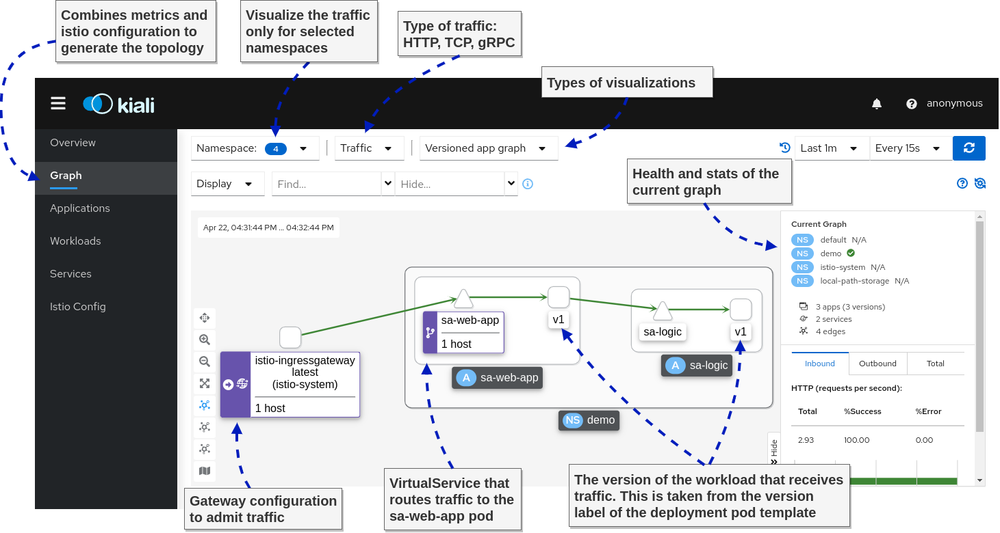

And next, we go to my favorite feature: Correlating metrics and traces, as shown below.

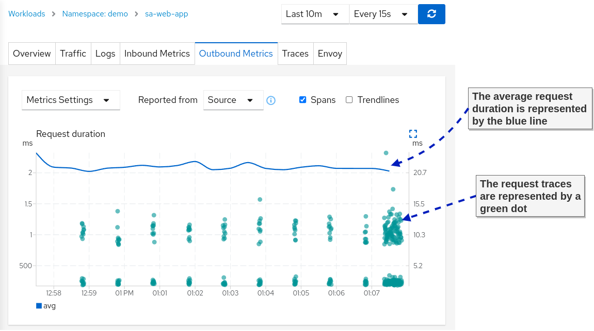

The correlation of metrics and traces makes it straightforward for application teams to find the slowest request and the path it took through the services. This way, it's easy to discover bottlenecks that the teams can focus on to improve their app performance.

Learn more about the correlation feature at the official docs for https://kiali.io/docs/features/tracing/#metric-correlation[metric correlation]

With that, we conclude the observability section of this article. Of course, all of the presented tools have more breadth and depth. However, the coverage here is enough to give you an idea about the observability that you gain over the system when adopting service meshes.

== Traffic management: Canary deployments

Having service-to-service traffic intermediated by layer 7 proxies enables complex traffic management capabilities. As an example, we are already using that when we route requests based on the path header in the ingress gateway. 

We can base routing decisions on any other HTTP information. Next, let's see how traffic management capabilities enable us to make deployments safe.

=== Making Continuous Delivery safe

In the entire tech industry, we learned empirically that most frequent service outages occur during workdays -- and rarely on the weekends.

That's because, during the week, changes are introduced to the system. 
We cannot avoid changes, but we have to find ways to make their delivery safer.

Continuous delivery can be thought of in two phases:

. *Deployment phase*: Deploy the application
. *Release phase*: Send end-user traffic to the application

==== Delivery Patterns

The "Deployment phase" is handled by the platform. For example, that's what we use Kubernetes Deployments for.

The "Release phase" is where Istio's traffic management capabilities come in handy and allow for the implementation of the following delivery patterns: 

* *Canary Deployments* -- Validate the new deployment by routing only a fraction of the traffic to the latest version. Then validate the changes and only after that release it to all users.
* *Progressive Deployments* - A variation on the canary deployments where you gradually increase the percentage of traffic sent to the new version
* *Dark launch* - Not precisely about releasing software safely, but about releasing it to a subset of users (such as beta users) and verifying how the changes are received
* *Traffic mirroring* - Mirror real user traffic to the new version of the application and ignore responses.

In this article, we'll show the canary deployment pattern to validate the new version of the app before we release it to real traffic. We cover more deployment patterns in the book https://livebook.manning.com/book/istio-in-action/chapter-5/73#:~:text=v1%20of%20catalog-,5.2.5%20Routing%20specific%20requests%20to%20v2,-Maybe%20we%20wish[Istio in Action.]

=== Canary deployments with Istio

When deploying another version of an app in Kubernetes, it immediately receives traffic, which means our users are routed to the new service. That's not what we want!

We actually want traffic to be routed only to the first version, even after deploying the second version of the application (and later on, we decide to release the second version to end-user traffic).

In Istio, the distinction between the versions is made using the DestinationRule API. With the destination rule below, we define the following subsets:

- Subset `v1` -- targets pods with the label `version: v1`
- Subset `v2` -- targets pods with the label `version: v2`

[source,bash,attributes]
----
apiVersion: networking.istio.io/v1alpha3
kind: DestinationRule
metadata:
  name: sa-logic
spec:
  host: sa-logic
  subsets:
  - name: v1
    labels:
      version: v1
  - name: v2
    labels:
      version: v2
----

Let's apply it to the cluster so that this distinction exists.

[source,bash,attributes]
----
kubectl apply -f istio/sa-logic-dr.yaml
----

Next, let's create a virtual service that configures service proxies to route traffic only to subset `v1` for any traffic targeting the `sa-logic` service.

[source,bash,attributes]
----
apiVersion: networking.istio.io/v1alpha3
kind: VirtualService
metadata:
  name: sa-logic
spec:
  hosts:
  - sa-logic
  http:
  - route:
    - destination:
        host: sa-logic
        subset: v1
      weight: 100
----

Apply to the cluster by executing the following command:

[source,bash,attributes]
----
kubectl apply -f istio/sa-logic-vs.yaml
----

Now, deploying the second version of the service won't release it to end-user traffic.

[source,bash,attributes]
----
kubectl apply -f kube/canary/sa-logic-v2.yaml
----

Verify that all traffic is routed to subset `v1` using the Kiali Graph dashboard (see figure below). 

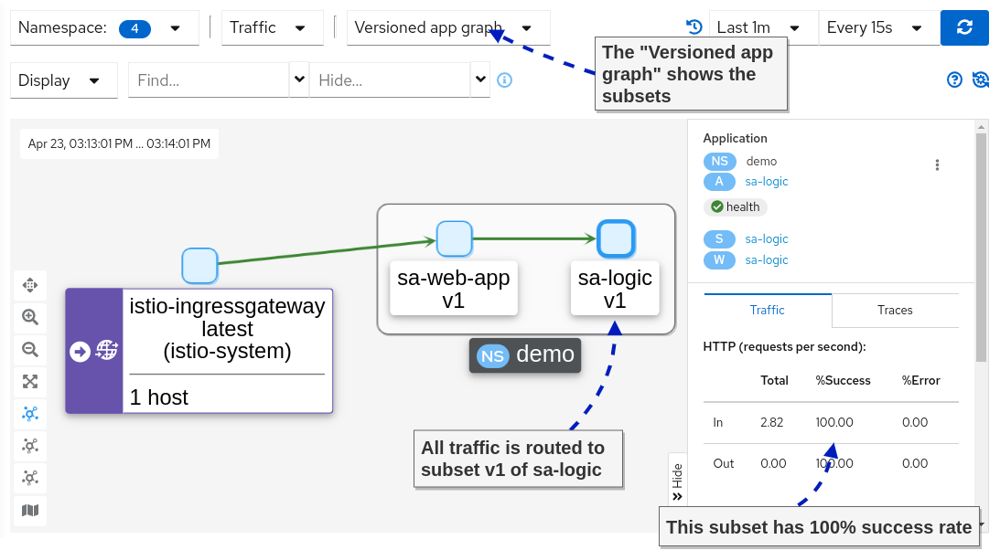

Next, let's send only 10 percent of end-user traffic to the new version of `sa-logic`, as visualized in the image below.

.The `DestinationRule` and the `VirtualService` configure the client-side
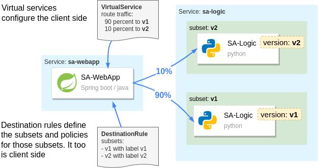

[source,bash,attributes]
----
apiVersion: networking.istio.io/v1alpha3
kind: VirtualService
metadata:
  name: sa-logic
spec:
  hosts:
  - sa-logic
  http:
  - route:
    - destination:
        host: sa-logic
        subset: v1
      weight: 90
    - destination:
        host: sa-logic
        subset: v2
      weight: 10
----

Apply it to the cluster.

[source,bash,attributes]
----
kubectl apply -f istio/sa-logic-vs-canary.yaml
----

After releasing the new version to end-user traffic, you can monitor it and validate it. Utilize the observability tools that we explored earlier. For example, after applying the change, we can observe in the Kiali Graph the success and error rate of the subsets.

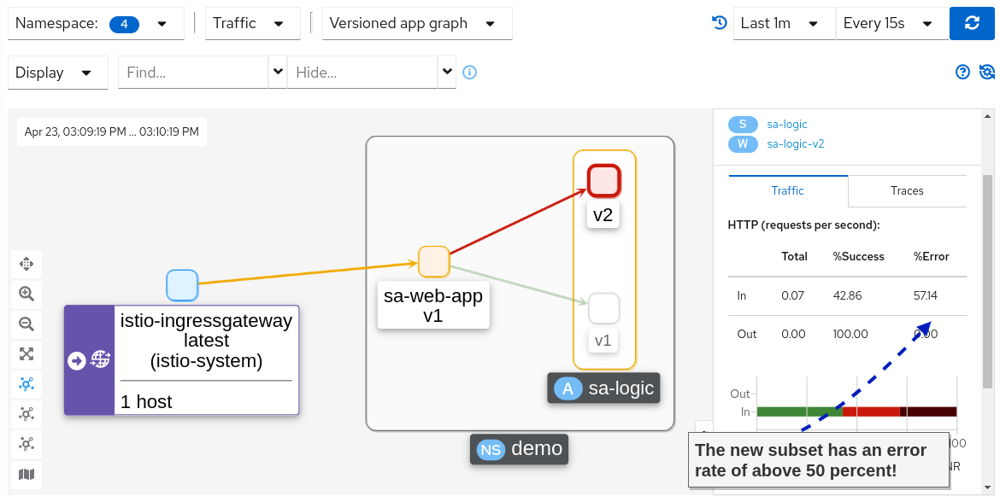

Holy mackerel! We do have an increase in the error rate! Let's update the virtual service to redirect all traffic to `v1`, which didn't have any errors.

[source,bash,attributes]
----
kubectl apply -f istio/sa-logic-vs.yaml
----

If you recheck the Kiali Graphs, you'll find that 100 percent of the traffic is routed to version 1, which didn't have any errors.

*Summary:* Releases in Kubernetes are always big bangs. You have a change that you want to ship, and if it has bugs, it impacts all of your users. However, Istio utilizes the service proxies to take fine-grained routing decisions that, when used, make releases safe.

Next, let's investigate Istio's security features -- this is getting exciting!!

== Istio Security

I would've never (ever) believed that security would be a topic that excites me! What on the technological spectrum could Istio possibly do to make this topic entertaining? And more importantly, why should you be excited too?

*The answer is simple:* Istio offloads security responsibilities from our application code and to the platform (specifically, the envoy proxies). Thus when traffic reaches our apps, it is already authenticated and authorized.

In the following sections, we will show how to authenticate and authorize both service-to-service, and end-user traffic using Istio.

.But first, let's make sure we have a common understanding of authentication and authorization:
* *Authentication* is when a client or server proves identity (i.e., answers "who" he is) using something it has, such as a certificate and or a JWT token.
* *Authorization* is the process of allowing or rejecting actions of authenticated users.

=== Auto mTLS: service-to-service authentication

Istio uses the _Secure Production Identity Framework for Everyone_ -- also known as SPIFFE -- to issue identity to workloads. Elaboration on how SPIFFE works is out of this article's scope. However, it suffices to know that Istio mints the workload's identity as an x509 certificate. +
Istio uses the Kubernetes `serviceaccount` assigned to the Kubernetes Pod, by Kubernetes itself as the source of identity. If your deployment doesn't specify a service account then the `default` service account is assigned to it.

[NOTE] 
For those interested in knowing more about SPIFFE, we dedicated https://livebook.manning.com/book/istio-in-action/appendix-c/["appendix C. Istio security: SPIFFE"] to it.

The minted certificate has workload metadata encoded, such as the namespace, the service account, etc. The proxies use this certificate to initiate mutually authenticated connections (mTLS). You can find the certificate in the envoy configuration. 

The following command queries the envoy configuration, filters it to the output we need, and decodes the certificate. You need to install https://smallstep.com/docs/step-cli/installation[step-cli] and https://stedolan.github.io/jq/download/[jq] to execute it.

[source,bash,attributes]
----
istioctl proxy-config all deploy/sa-webapp -o json | \
  jq -r '.. |."secret"? | select(.name == "default")' | \
  jq -r '.tls_certificate.certificate_chain.inline_bytes' | \
  base64 -d - | step certificate inspect
----

My output is shown below.

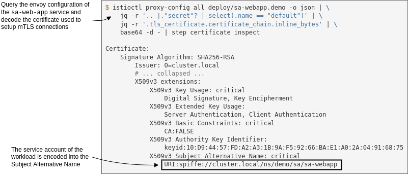

We mentioned that certificates are used to encrypt traffic and protect it from man-in-the-middle attacks; let's verify that next.

==== Service-to-service traffic is encrypted

To find out if the traffic is encrypted, we need to capture the traffic going through the pod. For that purpose, we will run a debug container within the pod with the following image `nicolaka/netshoot` (running debug containers requires Kubernetes version 1.23). +
The `netshoot` image has many network utilities, including `tcpdump`, a network capturing utility that we'll use.

Run the debug container with the following command.

[source,bash,attributes]
----
# Query the name of the sa-webapp pod
POD_NAME=$(kubectl get pods -l app=sa-webapp -o jsonpath={.items..metadata.name} | cut -d ' ' -f1)

# Run a debug container with tcpdump utility
kubectl debug -q -i $POD_NAME --image=nicolaka/netshoot -- \
  tcpdump -l --immediate-mode -vv -s 0 '(((ip[2:2] - ((ip[0]&0xf)<<2)) - ((tcp[12]&0xf0)>>2)) != 0)'
----

It may take a minute or two until the debug container is pulled and run. If you are still executing continuous queries to `sa-webapp`, you'll see a lot of traffic captured. However, you won't be able to gain any insights from it. Which is good, because **that's the idea -- it's encrypted! Tada!!**

Be warned that this benefit doesn't extend to legacy workloads, as we'll see next.

==== Traffic from legacy workloads is in clear-text

Begin by running a legacy workload that runs indefinitely. We'll create a new namespace and won't label it for automatic sidecar injection. Thus, the workload won't get the sidecar injected, it won't have an identity, and it cannot mutually authenticate.

[source,bash,attributes]
----
kubectl create ns legacy
kubectl -n legacy run workload --image=radial/busyboxplus:curl -- tail -f /dev/null
----

When the Pod is running, execute a cURL request from the legacy workload to the `sa-web-app` workload. 

[source,bash,attributes]
----
kubectl -n legacy exec workload -- \
  curl -i http://sa-webapp.demo/sentiment -H "Content-type: application/json" \
  -d '{"sentence": "I love yogobella"}'
----
Looking back at the output of the `tcpdump` command running in the `sa-webapp` pod, you will see the response in clear-text, as shown below.

[source,bash,attributes]
----
HTTP/1.1 200 OK
content-type: application/json;charset=UTF-8
date: Mon, 25 Apr 2022 12:14:02 GMT
x-envoy-upstream-service-time: 13
server: istio-envoy
x-envoy-decorator-operation: sa-web-app.demo.svc.cluster.local:80/*
transfer-encoding: chunked

2e
{"sentence":"I love yogobella","polarity":0.5}
----

Suppose the data would be sensitive, such as passwords, JWT tokens (which can be used in replay attacks), and so on. This represents a dangerous attack vector and is a risk for your organization.

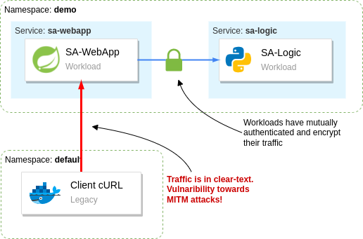

Istio gives us the tools to prevent workloads in the mesh from receiving clear-text traffic.

=== PeerAuthentication: Improving security defaults

By default, Istio configures the service proxies to use the _mTLS permissive_ mode, which means that non-authenticated traffic is permitted.

That's a sensible default, as it allows for a gradual migration of services into the mesh without causing downtime to your services.

After workloads have been migrated into the mesh, it is recommended to flip the mTLS mode to require mutually authenticated traffic strictly. That's achieved with the following `PeerAuthentication` configuration.

[source,bash,attributes]
----
apiVersion: "security.istio.io/v1beta1"
kind: "PeerAuthentication"
metadata:
  name: "default"
  namespace: "istio-system"
spec:
  mtls:
    mode: STRICT
----

This configuration applies to all workloads, beacuse, Istio uses a convention that configuration in the istio installation namespace (in our case `istio-system`) does so. However, it can be overwritten with a _namespace-wide_ configuration or _sidecar-specific_ configuration. 

Learn more about the https://istio.io/latest/docs/tasks/observability/telemetry/#scope-inheritance-and-overrides["Scope, Inheritance, and Overrides"] of Istio configuration. The explanation is about the Telemetry API but applies to the `PeerAuthentication`, and other Istio API's the same.

Apply the peer authentication configuration to the cluster.

[source,bash,attributes]
----
kubectl apply -f istio/security/peer-authentication.yaml
----

Verify that traffic from legacy workloads is rejected. 

[source,bash,attributes]
----
$ kubectl -n legacy exec workload -- \
    curl -i -Ss http://sa-webapp.demo/sentiment -H "Content-type: application/json" \
    -d '{"sentence": "I love yogobella"}'

curl: (56) Recv failure: Connection reset by peer
command terminated with exit code 56
----

The cURL command fails with the error `Recv failure: Connection reset by peer` as the service proxy doesn't accept the unauthenticated connection. 

=== Authorizing service-to-service traffic

Mutually authenticating services and encrypting traffic between them protects our data in transit. 

_But what happens when a malicious user gets hold of the identity of one of the workloads?_

*The malicious user could authenticate to every service and query sensitive data.* 

However, if we adhere to the principle of least privilege, we reduce each workload's access to only what is needed for its functions. Thus, we reduce the damage scope when an identity is stolen to only what it was permitted to access.

In Istio, we control the access using authorization policies. Basically, after workloads mutually authenticate and we know its identity, then we can apply policies, i.e. specify "what" actions the identity is allowed to perform.

I leave this as an optional exercise to you. You should implement authorization policies so that the mesh adheres to the principle of least privilege. Istio has a https://istio.io/latest/docs/tasks/security/authorization/authz-http/[quick example] to get you on the right path, and you'll find the detailed descriptions of the https://istio.io/latest/docs/reference/config/security/authorization-policy/[AuthorizationPolicy API reference] useful

.Summary of the access each service needs:
* The `istio-ingressgateway` can access the following services: 
** `sa-frontend`
** `sa-feedback`
** `sa-web-app`
* The `sa-web-app` can access the `sa-logic` service.
* All other access should be prohibited.

=== End-user authentication

Istio authenticates end-user requests using JWTs as a means of authentication. 

For end-users to receive a JWT token, we need an identity provider (IdP). We will use Keycloak as an IdP. However, any solution implementing the OpenID Connect Discovery (OIDC) standard will work the same.

==== Run Keycloak in the cluster

Begin by creating a namespace and deploying `keycloak` into it.

[source,bash,attributes]
----
kubectl create ns keycloak
kubectl -n keycloak apply -f kube/idp/keycloak.yaml

# wait for the rollout
kubectl -n keycloak rollout status deploy/keycloak
----

Wait until _keycloak_ is up and running; next, create a client application to represent the `sa-frontend` single-page application. Additionally, add the users listed in the table below.

[Attributes]
|===
|Username | Password | Group | UserType 

|user
|password
|users
|regular

|beta
|password
|users
|beta

|moderator
|password
|moderator
|regular
|===

[NOTE]
The `group` and `usertype` attributes are added as claims in the JWT token after authentication.

The creation of the client application and the users is automated with the script below. This spares you the process of going through the Keycloak UI and manually creating those.

[source,bash,attributes]
----
# 1. Port forward to the local environment
kubectl port-forward svc/keycloak -n keycloak  8081:8080 &
PID=$!
sleep 2

# 2. Create client and users
export KEYCLOAK_URL=http://localhost:8081/auth

export KEYCLOAK_TOKEN=$(curl -d "client_id=admin-cli" -d "username=admin" -d "password=admin" -d "grant_type=password" "$KEYCLOAK_URL/realms/master/protocol/openid-connect/token" | jq -r .access_token)
echo $KEYCLOAK_TOKEN

# Create initial token to register the client
read -r client token <<<$(curl -H "Authorization: Bearer ${KEYCLOAK_TOKEN}" -X POST -H "Content-Type: application/json" -d '{"expiration": 0, "count": 1}' $KEYCLOAK_URL/admin/realms/master/clients-initial-access | jq -r '[.id, .token] | @tsv')

# Register the client
read -r id secret <<<$(curl -X POST -d "{ \"clientId\": \"sa-frontend\", \"implicitFlowEnabled\": true }" -H "Content-Type:application/json" -H "Authorization: bearer ${token}" ${KEYCLOAK_URL}/realms/master/clients-registrations/default| jq -r '[.id, .secret] | @tsv')

# Add allowed redirect URIs
curl -H "Authorization: Bearer ${KEYCLOAK_TOKEN}" -X PUT \
  -H "Content-Type: application/json" -d "{\"serviceAccountsEnabled\": true, \"directAccessGrantsEnabled\": true, \"authorizationServicesEnabled\": true, \"redirectUris\": [\"http://localhost:8080/\"]}" $KEYCLOAK_URL/admin/realms/master/clients/${id}

# Add the group attribute in the JWT token returned by Keycloak
curl -H "Authorization: Bearer ${KEYCLOAK_TOKEN}" -X POST -H "Content-Type: application/json" -d '{"name": "group", "protocol": "openid-connect", "protocolMapper": "oidc-usermodel-attribute-mapper", "config": {"claim.name": "group", "jsonType.label": "String", "user.attribute": "group", "id.token.claim": "true", "access.token.claim": "true"}}' $KEYCLOAK_URL/admin/realms/master/clients/${id}/protocol-mappers/models

# Add the user type attribute in the JWT token returned by Keycloak
curl -H "Authorization: Bearer ${KEYCLOAK_TOKEN}" -X POST -H "Content-Type: application/json" -d '{"name": "usertype", "protocol": "openid-connect", "protocolMapper": "oidc-usermodel-attribute-mapper", "config": {"claim.name": "usertype", "jsonType.label": "String", "user.attribute": "usertype", "id.token.claim": "true", "access.token.claim": "true"}}' $KEYCLOAK_URL/admin/realms/master/clients/${id}/protocol-mappers/models

# Create regular user
curl -H "Authorization: Bearer ${KEYCLOAK_TOKEN}" -X POST -H "Content-Type: application/json" -d '{"username": "user", "email": "user@acme.com", "enabled": true, "attributes": {"group": "users", "usertype": "regular"}, "credentials": [{"type": "password", "value": "password", "temporary": false}]}' $KEYCLOAK_URL/admin/realms/master/users

# Create beta user
curl -H "Authorization: Bearer ${KEYCLOAK_TOKEN}" -X POST -H "Content-Type: application/json" -d '{"username": "beta", "email": "beta@acme.com", "enabled": true, "attributes": {"group": "users", "usertype": "beta"}, "credentials": [{"type": "password", "value": "password", "temporary": false}]}' $KEYCLOAK_URL/admin/realms/master/users

# Create moderator user
curl -H "Authorization: Bearer ${KEYCLOAK_TOKEN}" -X POST -H "Content-Type: application/json" -d '{"username": "moderator", "email": "moderator@acme.com", "enabled": true, "attributes": {"group": "moderator", "usertype": "regular"}, "credentials": [{"type": "password", "value": "password", "temporary": false}]}' $KEYCLOAK_URL/admin/realms/master/users

# 3. Stop port-forwarding
kill $PID
----

After that completes successfully, you'll be able to proceed to the next section.

=== Exposing the Keycloak service

The OIDC standard enables client applications to identify end-users. The client app starts the process by redirecting users to the authentication server. First, users authenticate themselves, and then the authentication server returns the user to the client application with a token representing their identity.

The authentication server has to be accessible to end-users. That's why we must expose `keycloak` through Istio's ingress gateway too.

The updated virtual service that configures traffic routing to keycloak can be applied with the command below. Feel free to check out the file and learn about the changes.

[source,bash,attributes]
----
kubectl apply -f istio/vs-route-ingress-keycloak.yaml
----

Next, we need to update the client application -- `sa-frontend` -- to redirect the user to the frontend. You can learn about the code https://github.com/rinormaloku/master-istio/blob/main/services/sa-frontend/src/App.js#L80-L83[here]. However, you can spare yourself the details and just apply the prebuilt image with those changes.

[source,bash,attributes]
----
kubectl set image deployment/sa-frontend sa-frontend=rinormaloku/sentiment-analysis-frontend:keycloak
----

Wait until the Pod is running and then refresh the `sa-frontend` page.

The new version redirects you to `Keycloak` for authentication. Use the credentials `user / password` to log in. Upon successful log in you'll receive a JWT token and will be redirected back to the client. 

As a result, subsequent requests for sentence analysis will contain the JWT token based on which we can authenticate and authorize the end-user.

=== RequestAuthentication: authenticate end-user requests

The recommended approach to authenticate end-user traffic is in the ingress gateway. This reduces the amount of processing as unauthenticated and unauthorized traffic is rejected early on. However, if you want to propagate the JWT token across services you must update your services to pass it on.

The figure below, shows the roles and their access to our services, that we will implement next.

.Summary of the access levels:
* All users can access the `sa-frontend` service (which is important to initiate the authentication flow)
* Authenticated users can access `sa-webapp` in addition to the `sa-frontend` access
* Moderators can access all services

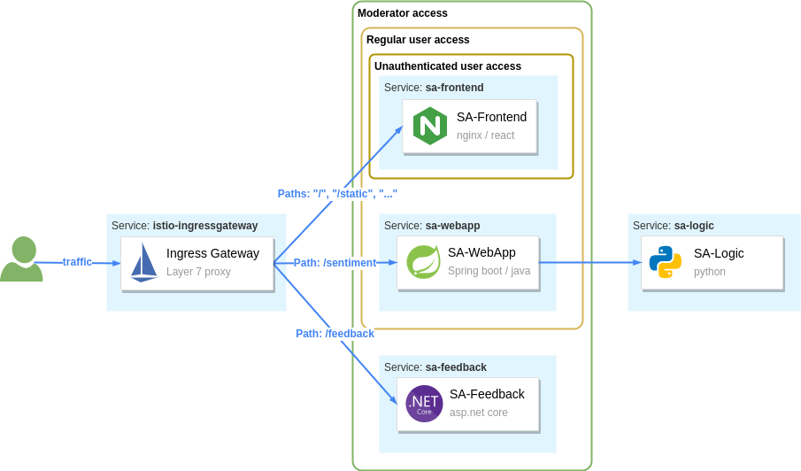

The `RequestAuthentication` API is used to configure authentication of end-user JWTs. For example, with the configuration below we authenticate JWTs issued by `keycloak`.

[source,bash,attributes]
----
apiVersion: "security.istio.io/v1beta1"
kind: "RequestAuthentication"
metadata:
  name: "keycloak-request-authn"
  namespace: istio-system
spec:
  selector:
    matchLabels:
      app: istio-ingressgateway
  jwtRules:
  - issuer: "http://localhost:8080/auth/realms/master" (1)
    jwksUri: http://keycloak.keycloak.svc:8080/auth/realms/master/protocol/openid-connect/certs (2)
----

.Elaborating the Jwt Rule attributes seen in the above listing:
. Tokens that match this issuer are authenticated with this JWT rule
. Matched tokens are validated against the JWKS found at this URI

Apply it to the cluster. 

[source,bash,attributes]
----
kubectl apply -f istio/security/request-authentication.yaml
----

You might expect that requests without JWT tokens are rejected from now on, but you'd be wrong. The `RequestAuthentication` resource only authenticates requests containing the JWT token; other requests are passed as is.

Verify that by triggering a request without a token, it is admitted and served, as shown below:

[source,bash,attributes]
----
$ curl -S http://localhost:8080/sentiment \
    -H "Content-type: application/json" \
    -d '{"sentence": "I love yogobella"}'

{"sentence":"I love yogobella","polarity":0.5}
----

However, there is a difference between requests that contain a JWT token and ones without a token. The former will have the identity data stored in the connection metadata. Meanwhile, the latter lacks the identity data in the connection metadata. The connection metadata are referred to as connection identity or request identity. 

[NOTE]
The request identity is composed of the authenticated data through `RequestAuthentication` and `PeerAuthentication`. Thus you can control access based on both the end-user and the service making the request.

The policies make decisions to admit or reject traffic based on the request identity.

=== AuthorizationPolicy: admitting and rejecting requests

Using the `AuthorizationPolicy` API, you can configure the proxies to accept or reject traffic. 

We want _all users_, even unauthenticated ones, to access the `sa-frontend`, and `keycloak` services (so that users can authenticate themselves in the first place). And only after that do we know "who" the user is, and we can apply policies to determine "what" actions they are allowed to perform.

We achieve that with the policy below. It allows any traffic to the listed paths (the paths are for the `sa-frontend` and `keycloak` services).

[source,bash,attributes]
----
apiVersion: security.istio.io/v1beta1
kind: AuthorizationPolicy
metadata: 
  name: allow-view
  namespace: istio-system
spec:
  selector:
    matchLabels:
      app: istio-ingressgateway
  action: ALLOW
  rules:
  - to:
    - operation:
        paths: ["/", "/static*", "/auth*"]
----

Apply it to the cluster.

[source,bash,attributes]
----
kubectl apply -f istio/security/allow-view.yaml
----

Now users can authenticate and receive a JWT token, which is used in subsequent requests to the cluster services. The `RequestAuthentication` configuration authenticates the JWT, and as a result, claims from the token are stored as connection metadata. +
The key metadata that we use in the next section is the `requestPrincipals` which Istio constructs by combining the `iss` and `sub` claims of the JWT token.

==== Admitting requests based on the connection metadata

With the policy below we allow requests from any of the matching `requestPrincipals` for all paths prefixed with `/sentiment`. 

[source,bash,attributes]
----
apiVersion: security.istio.io/v1beta1
kind: AuthorizationPolicy
metadata: 
  name: allow-analysis
  namespace: istio-system
spec:
  selector:
    matchLabels:
      app: istio-ingressgateway
  action: ALLOW
  rules:
  - from:
    - source:
        requestPrincipals: ["*"]
    to:
    - operation:
        paths: ["/sentiment*"]
----

For a policy to apply to incoming traffic, it must match both the `source` and the `operation`. For example, the above policy will apply and allow traffic only if:

* *source* - matches all requestPrincipals because of the wildcard. However, it won't match if the request lacks any request principal. The request principal for a request is assigned only after a `RequestAuthentication` validates the JWT token.
* *operation* - matches all requests whose path is prefixed with `/sentiment`

Apply it to the cluster. 

[source,bash,attributes]
----
kubectl apply -f istio/security/allow-analysis.yaml
----

Verify that you can analyze sentences. If everything is fine, proceed to the next section.

==== Different levels of access

The `sa-frontend` allows users to send feedback after analyzing a sentence. But currently, if you try sending feedback, the request will fail with "Not authorized."

image::images/frontend-unauthorized.png[]

This happens because no policy explicitly allowed the request; thus, it will deny it by default. Next, we want to allow this action only for moderators.

We make the distinction between moderators and users using the `group` claim. Thus we achieve that with the following policy.

[source,bash,attributes]
----
apiVersion: security.istio.io/v1beta1
kind: AuthorizationPolicy
metadata: 
  name: allow-feedback-for-mods
  namespace: istio-system
spec:
  selector:
    matchLabels:
      app: istio-ingressgateway
  action: ALLOW
  rules:
  - from:
    - source:
        requestPrincipals: ["*"]
    when:
    - key: request.auth.claims[group]
      values: ["moderator"]
----

Apply it to the cluster:

[source,bash,attributes]
----
kubectl apply -f istio/security/allow-feedback.yaml
----

To verify that moderators can send feedback, follow these steps: open an incognito window; log in with the credentials `moderator / password`; type a sentence; submit feedback. It will succeed!

In the security section, we learned three custom resources: 
- `PeerAuthentication` -- for authentication of peers
- `RequestAuthentication` -- for authentication of end-users
- `AuthorizationPolicy` -- for allowing or rejecting requests based on the authenticated data.

== Summary

Hey! You got to the bottom of this article! Congrats, and well done! It was a rather long one, but after investing a few hours into it and on yourself -- you have a clear idea of what `Istio` is and what it can do for you and your business.

.A summary of what we covered:
* Service meshes are implemented by adding a proxy alongside the application and intercepting all network traffic to and from it. 
* The proxy enables:
** *Advanced traffic management*
*** Using `Gateways`, we define the traffic that is accepted into a service proxy (including the ingress gateway)
*** Using `VirtualServices`, we define how to route traffic to a destination. 
*** Using `DestinationRules`, we define policies after routing has occurred. In our instance, we only used it to define subsets. 
** *Making an observable system by generating telemetry*
*** Access logs record the results of individual requests.
*** Traces show the flow of a request through services. Visualized by Inspector Gadget (_I couldn't resist, but you know that I mean Jaeger ;P_) and Kiali
*** Metrics measure properties of the system, success rate, operations per second, and so on.
** *Security*
*** The `PeerAuthenticaiton` resource enforces only mutually authenticated traffic, ensuring that all service-to-service traffic is encrypted and that clear-text traffic is rejected.
*** The `RequestAuthentication` resource authenticates JWT tokens against the configured JWKS.
*** The `AuthorizationPolicy` resource enables us to make decisions on whether to accept or reject traffic.

=== Additional reading

After reading until here, you know more about Istio than many folks out there, even some that run services on production with it.

However, some of Istio's quirks might catch you by surprise; sometimes, your application and the proxy might misbehave. And you will have questions such as:

* How to troubleshoot the service proxy or the ingress gateway?
* How to make sense of the Envoy configuration that is applied?
* How to use fault injection?
* Securing traffic at the edge
* How to set up multi-cluster service meshes? What is happening behind the scenes?
* Is the integration of machine-based workloads possible? If yes, how?
* How to use external authorization servers? 
* Day 2 operations

We answer these and many other questions in the book https://www.manning.com/books/istio-in-action?utm_source=rinor&utm_medium=affiliate&utm_campaign=book_posta2_istio_9_30_18&a_aid=rinor&a_bid=9f6a70f3["Istio in Action."] What really makes me proud about the book -- besides it being the most in-depth elaboration of Istio -- is how much reference value it has! It's crazy; I find myself and other Field Engineers here at Solo going back to it whenever we solve some tricky issue, such as DNS resolution, troubleshooting cross-cluster traffic, and so on.

.Other useful resources:
* https://istio.io/latest/docs/reference/config/[Istio configuration reference] 
* https://istio.io/latest/blog/[Istio's blog]
* Solo's https://www.solo.io/blog/[blog] and https://www.youtube.com/channel/UCuketWAG3WqYjjxtQ9Q8ApQ[YouTube channel]
* https://blog.christianposta.com/[Christian Posta's blog]
* https://karlstoney.com/tag/istio/[Karl Stoney's blog]

I seize the opportunity to say thanks for joining me on this voyage. It wasn’t easy, and you are amazing for sticking with it. I would love to hear your thoughts in the comments below, and feel free to reach out to me on Twitter (https://twitter.com/rinormaloku[@rinormaloku]) or on my page https://rinormaloku.com[rinormaloku.com].